# сочинение на тему: знакомство с mongoDB

## установка mongoDB

Начала с Homebrew   
Прекрасный удобный менеджер сделал все за меня. За иконки с пивом отдельный лайк

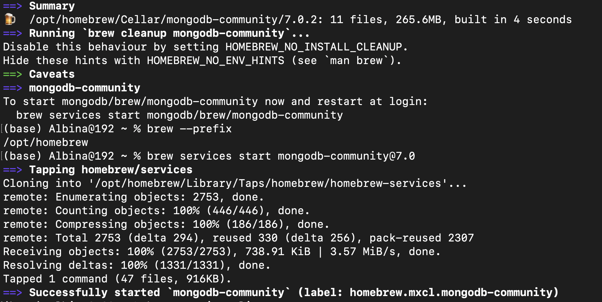

## Запуск docker

Запуллила последнюю версию mongo image и подняла контейнер (без yaml, а кто осудит?)  

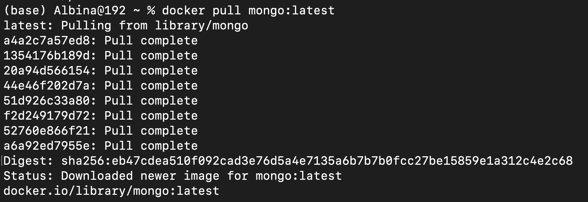

3-х попыток мне хватило, чтобы понять, как запустить mongo


Создались какие-то целых 2 volume, я на них надеюсь

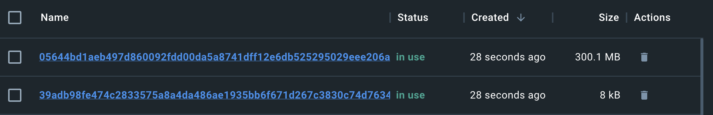

## Скачиваем Compass и let's go

Скачала Compass и подключила к локальному хосту

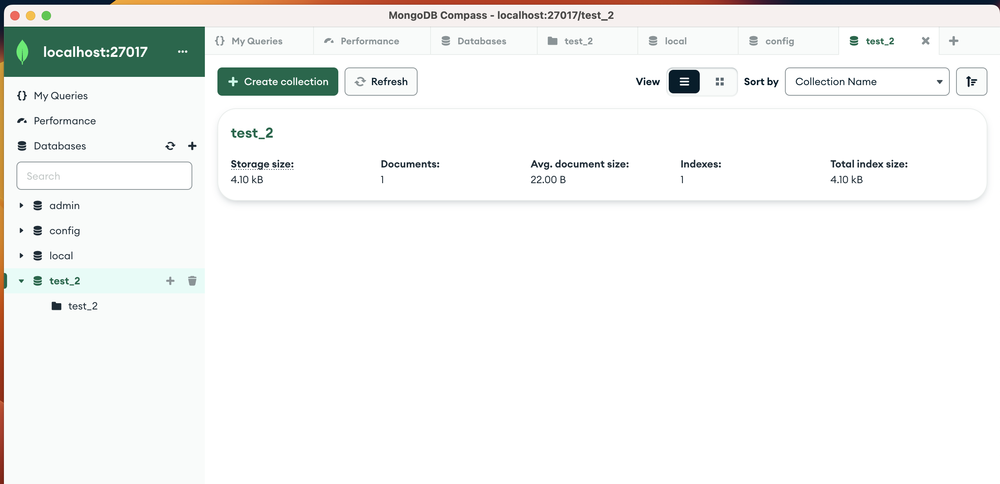

Теперь загрузим базу данных. Инфу взяла из [лондонских данных](https://data.london.gov.uk/dataset/public-transport-journeys-type-transport), раз уж Яндекс.Такси долго на mongo сидели, то почему бы и нам данные по общественному транспорту в Лондоне не подгрузить

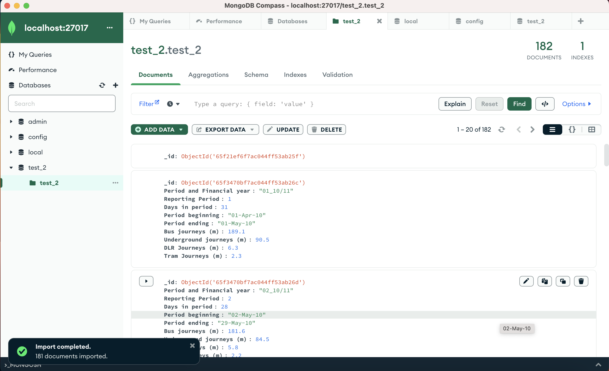

## .insertOne(), .find()

Попробуем вставить документ: скопируем имеющийся, поменяем `_id` и одно поле

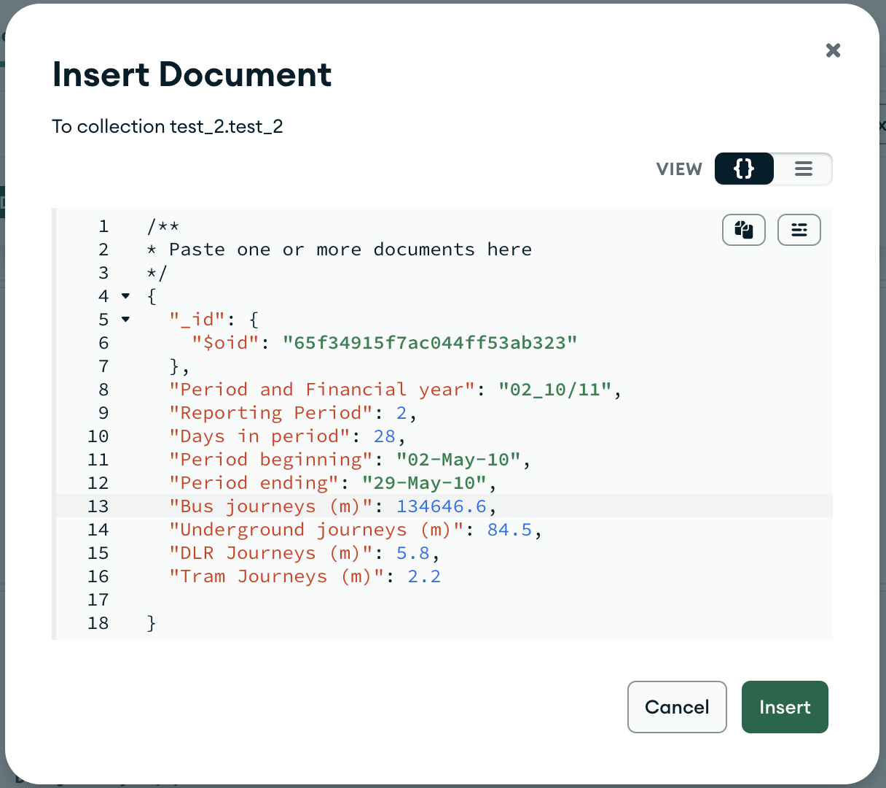

Получилось! А что, если не менять `_id`?


Не вышло :с    
Поменяем _только_ `_id` и воспользуемся `find()` 

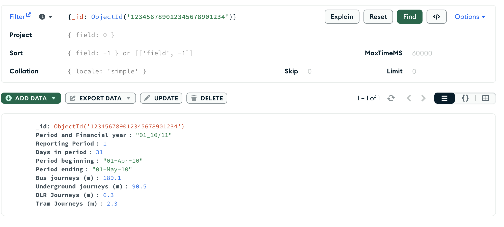

## .insertMany()

Попробуем вставить несколько документов, при этом в одном из них уберем часть полей

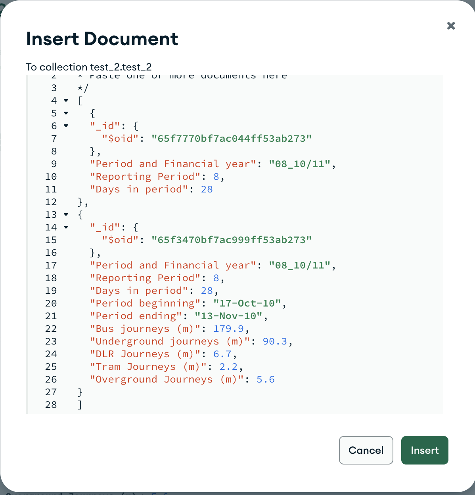

## .updateMany()

`.updateOne()` в Compass довольно скучный и удобный, давайте заменим сразу много с фильтром


## .deleteOne(), .deleteMany()

Попробуем поудалять: один удалить вообще скучно, а вот несколько по фильтру с регуляркой - уже интереснее

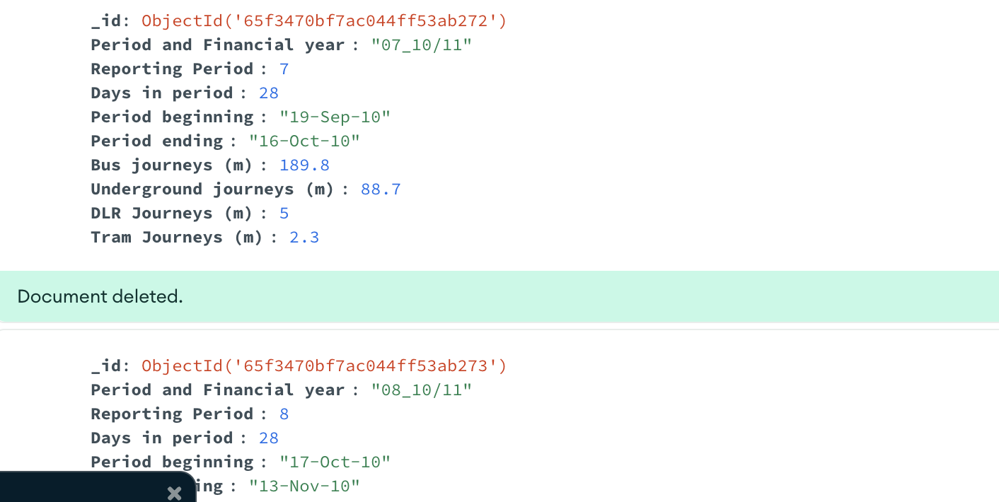

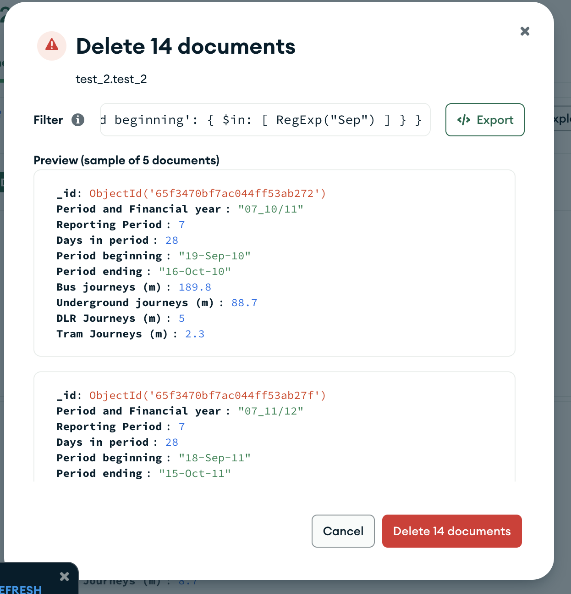

## index

Кажется, нашей базы в 150 измерений недостаточно, чтобы померить эффективность   
Накинем [еще](https://www.kaggle.com/datasets/seanangelonathanael/bank-target-marketing) данных

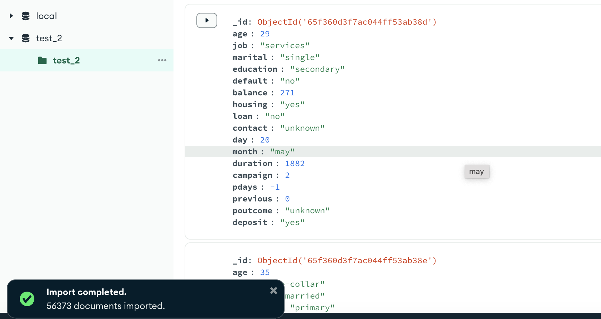

Сделаем `.find()`: `{ job: { $regex: "(?-i)c(?-i)" } }`   
Без индексов поиск работает за следующее время

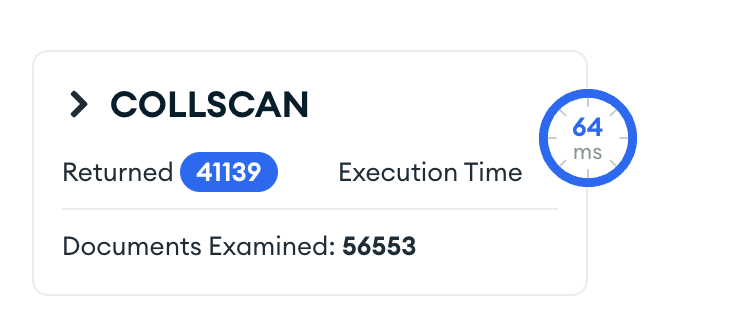

Теперь накинем индекс по полю `job` с регулярным типом (`asc`)

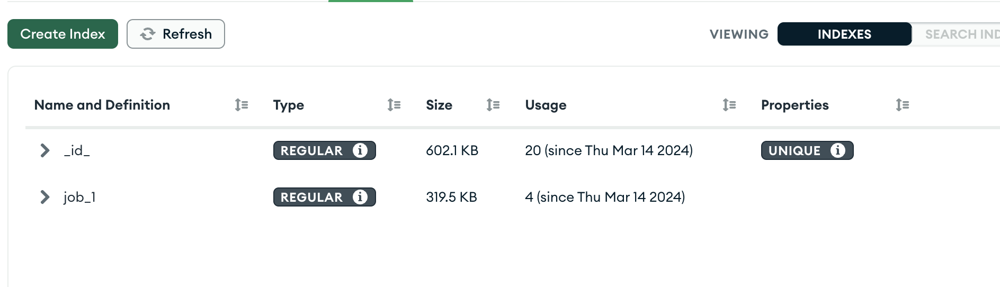

Проверим время работы 

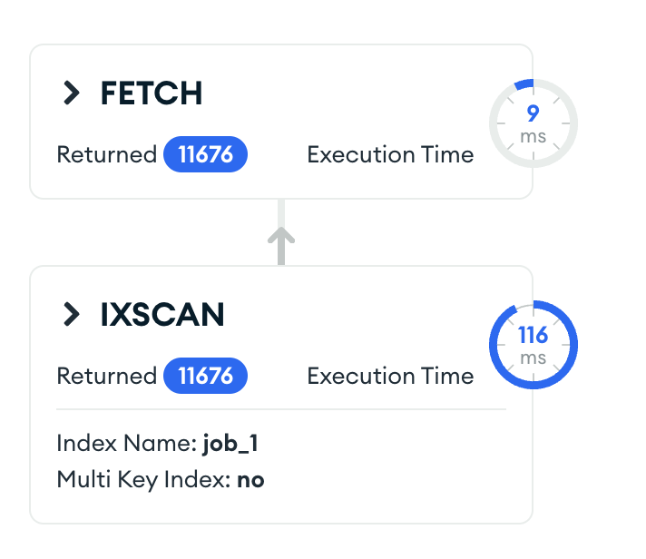

Вот это для меня осталось загадкой дыры... (Кстати, запрос на то, чтобы значение начиналось с определенной буквы, не отработал быстрее. Хотя по идее индекс - это про сортировку?)  


Но в мануале написано, что текстовые индексы подходят именно для текстовых запросов  
Меняем тип индекса и смотрим

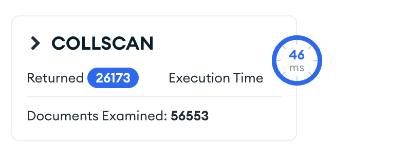

На сим и закончим

## Выводы

MongoDB оказалась очень приятной базой, ну а GUI Compass ну так вообще мед, медятина...  
Но, наверное, реализуя промышленное решение, нужно вот эту ее готовность к любым экспериментам с данными усмирять  
Для локального использования -- отлично!


```python

```


```python

```
