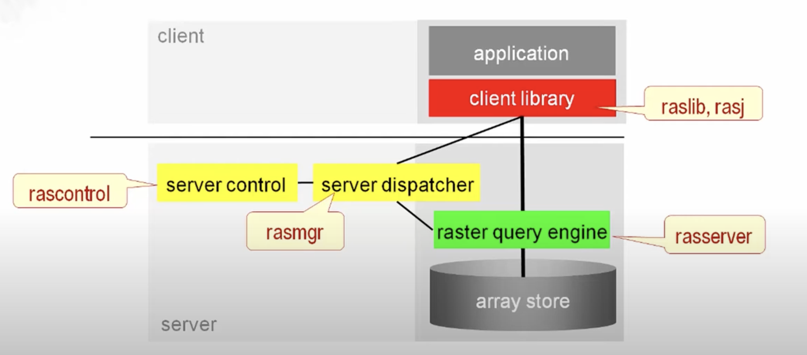
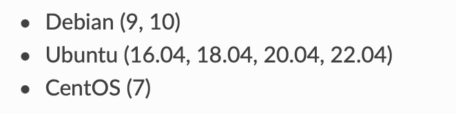
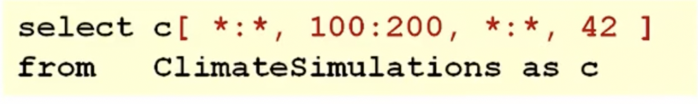
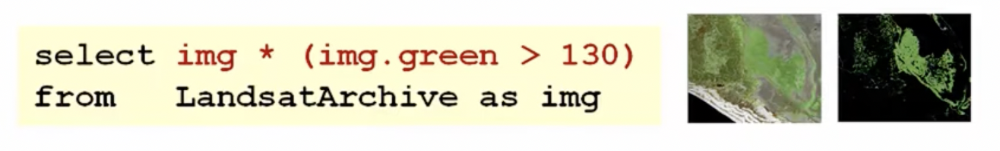
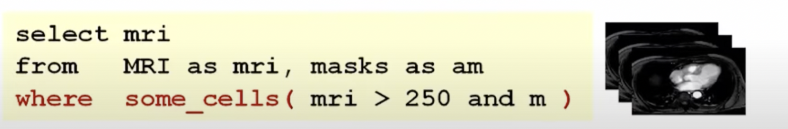
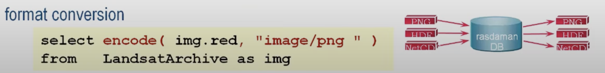
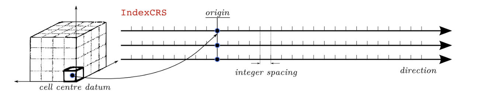
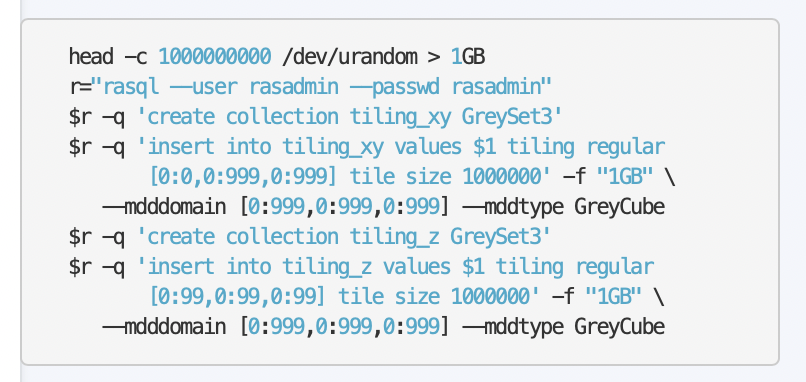
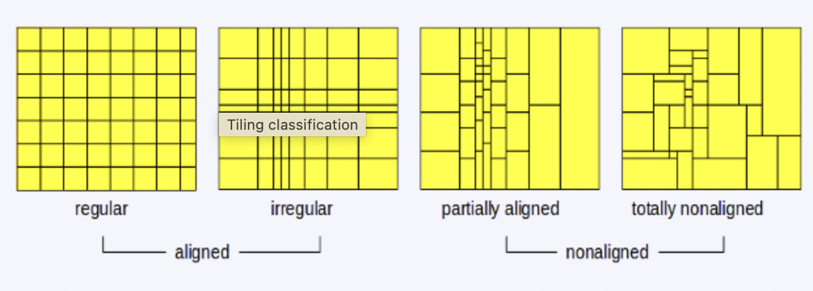

# Rasdaman

## История развития СУБД

Создатель, Питер Бауманн, в 1989 начал исследование по созданию БД для изображений


После углубленного исследования формализации растровых данных в визуализации, он создал СУБД для многомерных массивов, включая модель данных и декларативный язык запросов. Сегодня многомерные массивы также известны как [кубы данных](https://365datascience.com/trending/data-cube/).  

На базе Технического Университета Мюнхена родился проект RasDaMan, спронсирующийся ЕС. За осонову была взята СУБД [O2](https://dbdb.io/db/o2).      

**rasdaman GmbH** - коммерческое продолжение данной СУБД 

## Инструменты для взаимодействия с СУБД

1. rasQL   
2. используя raslib/rasj функцию `oql_execute()`, отправляя запрос на их сервер

## Какой database engine используется в вашей СУБД?



## Как устроен язык запросов в вашей СУБД? Разверните БД с данными и выполните ряд запросов. 

Кажется, только на данных ОС rasdaman нормально раскатывается



Поэтому посмотрим запросики из демонстрации самого Питера Бауманна

Следующим образом можно взять определенный слайс данных. В данном примере берется 3-х мерный массив из 4-х мерных данных   


Данным запросом можно вычленить только те пиксели, где зеленый превышает некоторый трешхолд. Если `img.green > 130 == 0`, то возвращается 0 и участок заполняется черным



В данном запросе `some_cells()` ищет значение из `mri` в массиве `am` *(в запросе, видимо, опечатка)*



[ilovepdf](https://www.ilovepdf.com) до того, как это стало мейнстримом     


## Распределение файлов БД по разным носителям?

За алгоритмами Бауманн ссылает наc к статьям:    
1. L. Chen, R. Drach, M. Keating, S. Louis, D. R.otem, A. Shoshani: Efficient Organization and Access of Multi- dimensional Datasets on Tertiary Storage Systems. Information Systems Journal, April 1995.    
2. S. Sarawagi, M. Stonebraker: Efficient Organization of Large Multidimensional Arrays. Tenth Int. Conf on Data Engineering, pp. 328-336, Houston, Feb. 1994.

## На каком языке/ах программирования написана СУБД?

Из той же статьи:    
The RasDaman API consists of RasQL and the **C++** Raster Library (RasLib) which serves for the integration of the MDD type into the **C++ language**

## Какие типы индексов поддерживаются в БД? Приведите пример создания индексов.

1. **R+ tree**   
General index structure that works with all tiling schemes.  


2. **Directory index**  
Directory of interval objects index like an R+ tree works with all tiling schemes.  


3. **Regular computed index**  
Special index that works only with regular tiling. It should provide speed advantage over any other index, however there is a bug at the moment.

Индексы основаны на `tilling'е` - это, говоря простыми словами, деление данных по кускам



Пример с `regular tilling`, который делит данные на плитки одинакого размера





## Как строится процесс выполнения запросов в вашей СУБД?

Узлы также обмениваются статистическими данными (скорость сети, свободное место для хранения, производительность процессора). Узел rasdaman, получивший запрос, может использовать их для определения наиболее подходящего узла в сети для выполнения операции, распределяя таким образом нагрузку на обработку между узлами. Например, операции, требующие больших затрат процессора, могут быть переданы узлу, имеющему самый мощный процессор из числа тех, которые содержат запрошенную коллекцию, в то время как данные могут быть получены с узла с лучшей производительностью сети и более высокой скоростью чтения с диска.

## Есть ли для вашей СУБД понятие «план запросов»? Если да, объясните, как работает данный этап.

Да    

Вычислитель запросов анализирует запрос RasQL и строит дерево запросов на основе операторов. Это дерево запросов оптимизируется в два этапа: алгебраическое переписывание запроса и вторая физическая оптимизация на основе разбиения на листы, кластеризации и информации об устройстве. Частью этого является настройка последовательности операций с фрагментами и изменение порядка доступа к фрагментам для определения оптимальной с точки зрения затрат последовательности оценки. Многомерный индекс помогает идентифицировать фрагменты, участвующие в запросе, и рассчитать затраты на их извлечение. Другие внутренние компоненты управляют каталогом схем и характеристиками устройств хранения данных, используемыми для планирования выполнения запросов с учетом затрат. Среди доступных утилит - RasDaView, визуальный интерфейс для поиска и обработки массивов n-D, а также RasDL schema processor.

## Поддерживаются ли транзакции в вашей СУБД? Если да, то расскажите о нем. Если нет, то существует ли альтернатива?

Да, существуют транзакции   

Начиная с версии `9.0` во время выполнения транзакции над одной ячейкой (на которые делятся данные с помощью `tilling`) блокируется доступ на запись и чтение другим пользователям

## Какие методы восстановления поддерживаются в вашей СУБД. Расскажите о них.

Предлагается самому (вручную?) делать backup - даются техники его выполнения для маленьких и больших файлов, с учетом размера ячеек (`tilling`), с архивированием, а также бэкапирование файлов конфигурации и логов

## Возможно ли применить термины Data Mining, Data Warehousing и OLAP в вашей СУБД?

### Data Mining

Данная СУБД заточена под работу с климатическими данными, изображениями, поэтому [есть примеры](https://www.researchgate.net/publication/319974186_A_datacube_approach_to_agro-geoinformatics) работ по предсказанию погоды, визуализации агро данных и тд 

### Data Warehouse

Не упоминается, но для климатических данных - почему нет

### OLAP

[Испанский диссер](https://www.researchgate.net/publication/329279339_Acquisition_and_Declarative_Analytical_Processing_of_Spatio-Temporal_Observation_Data) о том, как собирать и структурировать геоданные для дальнейшего анализа и OLAP для гос структур в том числе

## Какие методы защиты поддерживаются вашей СУБД? Шифрование трафика, модели авторизации и т.п.

В гайде по установке и администрированию есть [рекомендации](https://doc.rasdaman.org/9.7/02_inst-guide.html#id11) по механизмам прав доступа

## Какие сообщества развивают данную СУБД? Кто в проекте имеет права на коммит и создание дистрибутива версий? Расскажите об этих людей и/или компаниях.

Развивают Технический Университет Мюнхена совместно с Университетом Джейкоба.   
Контакты, что на сайте коммерческой версии, что на сайте бесплатной - ведут непосредственно к самому Бауманну =)   
Опенсорса нет

## Как продолжить самостоятельное изучение языка запросов с помощью демобазы. Если демобазы нет, то создайте ее.

По следующему запросу после установки СУБД    
```
$ rasdaman_insertdemo.sh localhost 7001 \
  $RMANHOME/share/rasdaman/examples/images rasadmin rasadmin
  ```

## Где найти документацию и пройти обучение

[Раз](https://doc.rasdaman.org/9.7/index.html)     
[Два](https://tutorial.rasdaman.org)    
[Три](https://doc.rasdaman.org/rasdaman.pdf)

## Как быть в курсе происходящего

Самостоятельно следить за релизами и Бауманном =)    
Форумов вообще по теме не нашла, даже в их мэйлинг лист уже не добавиться
